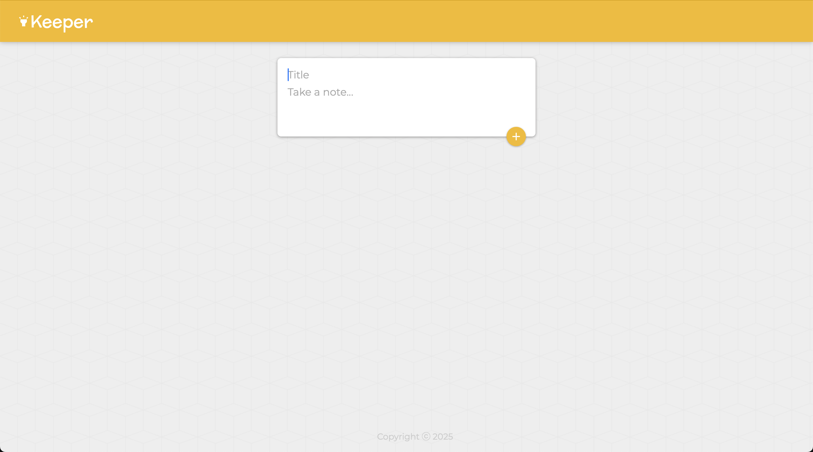

# Keeper-App

Keeper-App is a note-taking frontend web application that allows users to create, edit, and delete notes. It provides a simple and intuitive interface for managing your thoughts and ideas.

## Features

*   Create new notes with titles and content.
*   View and edit existing notes.
*   Delete notes you no longer need.

## Media

### Home Screen

### Sample Video
[Sample Video](media/sample_video.mov)

## Live Demo

You can view the live demo of the application here (may take up to 30 seconds to load):

[https://reactkeeperapp.onrender.com](https://reactkeeperapp.onrender.com)

## Tech Stack

*   React - JSX
*   JavaScript
*   CSS
*   HTML
