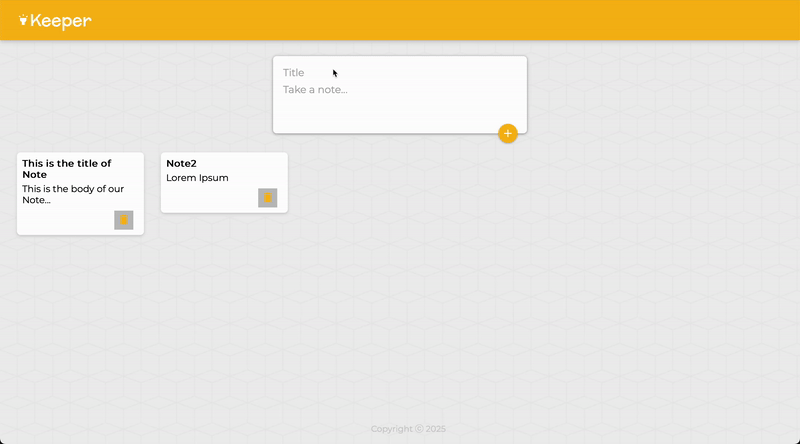

# Keeper-App

Keeper-App is a note-taking frontend web application that allows users to create, edit, and delete notes. It provides a simple and intuitive interface for managing your thoughts and ideas.

## Features

*   Create new notes with titles and content.
*   View and edit existing notes.
*   Delete notes you no longer need.

## Media

### Home Screen

### Sample Video

## Live Demo

You can view the live demo of the application here (may take up to 30 seconds to load):

[https://reactkeeperapp.onrender.com](https://reactkeeperapp.onrender.com)

## Tech Stack

*   React - JSX: Used for building the user interface and managing component state. JSX is used to write HTML-like syntax within JavaScript, making it easier to create and manage React components.
*   JavaScript: Used for implementing the application's logic, handling user interactions, and managing data flow between components.
*   CSS: Used for styling the application and making it visually appealing. CSS is used to define the layout, colors, fonts, and other visual aspects of the application.
*   HTML: Used as the base structure for the React components.
